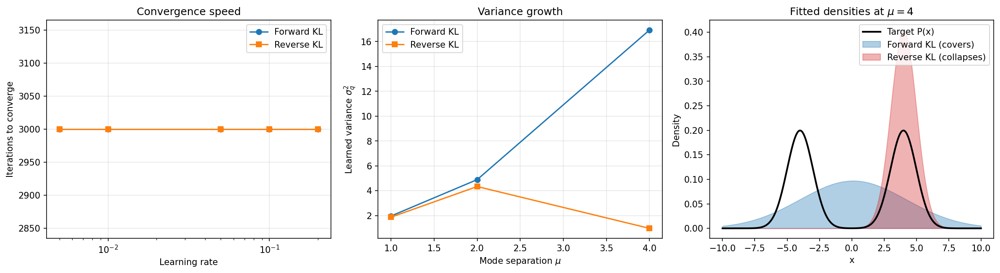

# Forward vs. Reverse KL Divergence: Mode-Covering vs. Mode-Seeking

Why does the **direction** of KL divergence change what a model learns? This project fits a single Gaussian `Q(x)` to a bimodal target `P(x)` under both forward `D_KL(P‖Q)` and reverse `D_KL(Q‖P)` divergence, and shows that the two directions produce fundamentally different solutions.



## The prediction (set before running the experiment)

The behaviour is determined by where each objective's gradient blows up:

- **Forward KL is zero-avoiding.** The penalty explodes wherever `P(x) > 0` but `Q(x) → 0`, so `Q` stretches to **cover** every mode of the target → high variance, mode-covering.
- **Reverse KL is zero-forcing.** The penalty explodes wherever `Q(x) > 0` but `P(x) → 0`, so `Q` **collapses** onto a single mode and avoids the empty region between modes → low variance, mode-seeking.

## What the experiment shows

| | Forward KL | Reverse KL |
|---|---|---|
| Final mean | ≈ 0 (centre) | ≈ one mode |
| Variance as separation grows | grows large | stays small |
| Initialization sensitivity | none | high (picks different modes) |

The fitted-density panel makes it visual: at mode separation `μ = 4`, forward KL spreads across both peaks while reverse KL sits tightly on one.

## Run it

```bash
pip install -r requirements.txt
jupyter notebook kl_divergence_experiment.ipynb
```

The experiment is synthetic and CPU-only — it runs in under a minute on any laptop. Outputs (`kl_core_comparison.csv`, `kl_sensitivity_analysis.csv`, `kl_summary.png`) are regenerated on run.

## Files

- `kl_divergence_experiment.ipynb` — full experiment and figures
- `kl_core_comparison.csv` — separation × initialization × direction results
- `kl_sensitivity_analysis.csv` — learning-rate sweep
- `kl_summary.png` — convergence speed, variance growth, and fitted densities

## Stack

PyTorch · NumPy · pandas · Matplotlib
